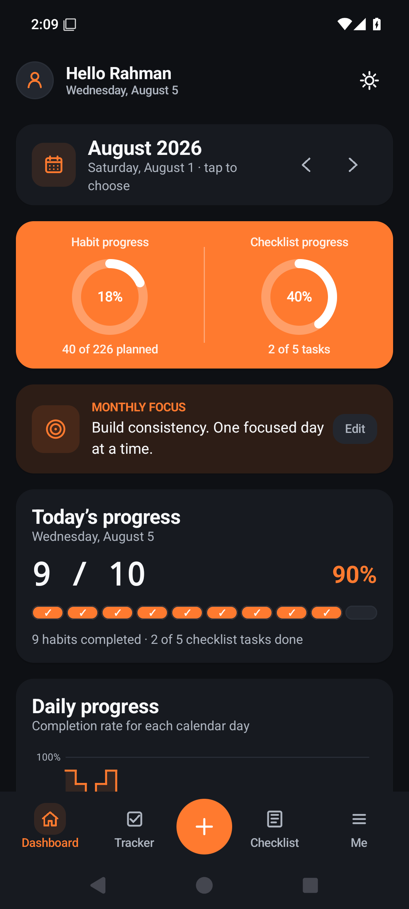
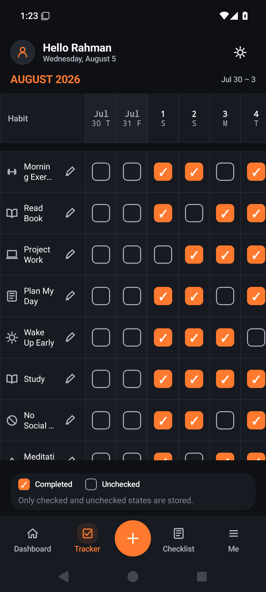
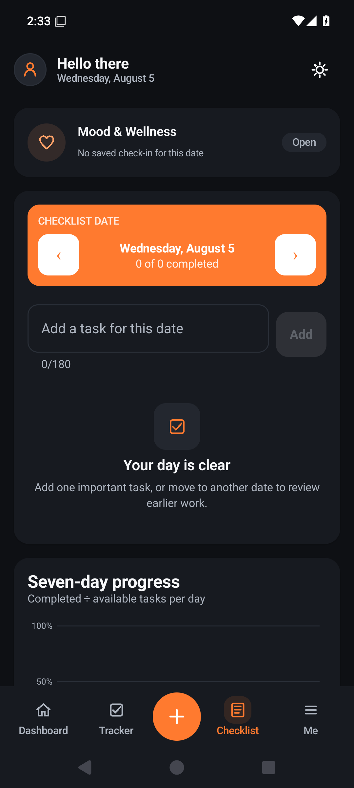
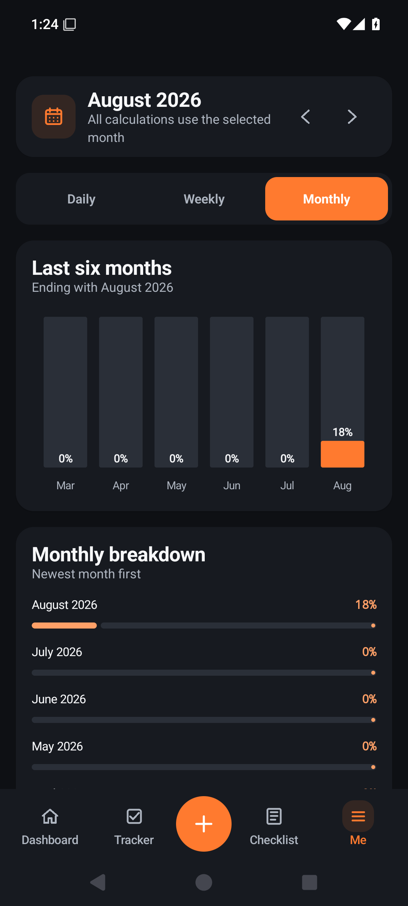
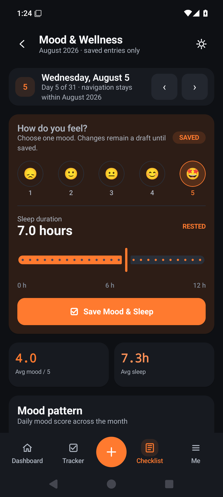
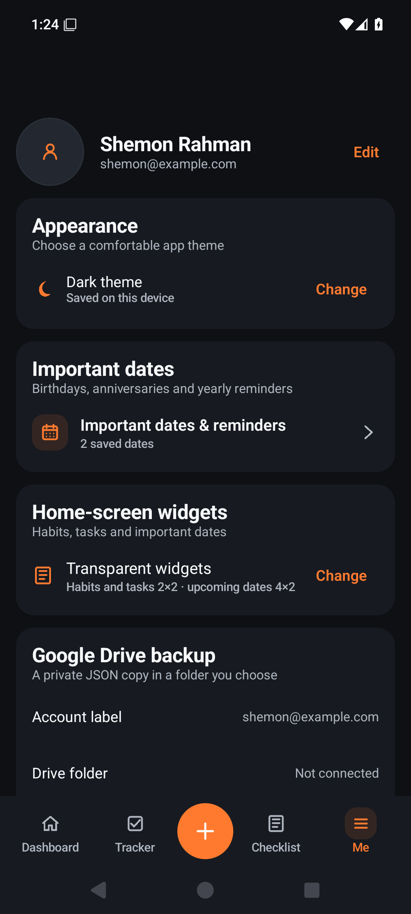
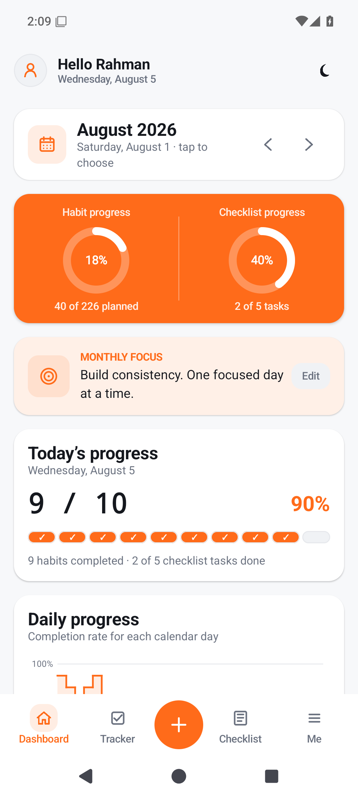
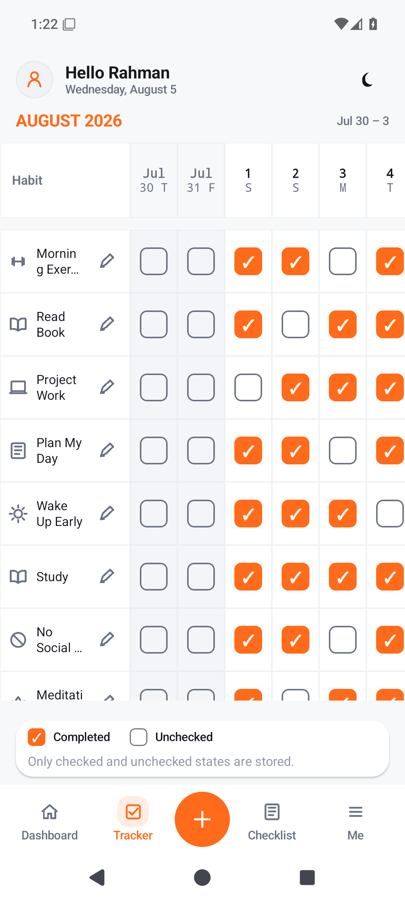

  

<h1 align="center">Daily Tracker</h1>

  A private, offline Android habit tracker, daily checklist, wellness log, reminder manager, and home-screen widget suite.

  <a href="https://github.com/Desir-16/DailyTracker/releases/latest"><strong>Download the latest official APK</strong></a>
  ·
  <a href="PRIVACY_POLICY.md">Privacy policy</a>
  ·
  <a href="SUPPORT.md">Support</a>

## Highlights

- Monthly habit tracking with genuine one-tap completion controls
- Dashboard progress, daily/weekly/monthly analysis, and habit details
- Independent daily checklist with unfinished-task carryover
- Mood and sleep logging
- Important-date reminders and calendar integration
- Habit, task, and upcoming-date home-screen widgets
- Optional user-controlled Google Drive backup and restore
- Light and dark themes
- Fully offline operation with no advertisements, analytics, or developer-operated server

## Screenshots

| Dashboard | Habit tracker | Checklist | Analysis |
|---|---|---|---|
|  |  |  |  |

| Wellness | Profile and settings | Light dashboard | Light tracker |
|---|---|---|---|
|  |  |  |  |

## Installation

1. Open the [latest release](https://github.com/Desir-16/DailyTracker/releases/latest).
2. Download `DailyTracker-v1.7-Production.apk`.
3. Compare its SHA-256 value with the supplied `SHA256.txt` file if desired.
4. Open the APK on an Android device and allow installation from that download source when Android asks.

Daily Tracker is signed with a permanent production certificate. Install only APKs published through this official repository or another distribution page linked by the developer.

## Privacy

Daily Tracker stores app information locally. Optional backups are written only to a folder selected by the user through Android's system file picker. See the complete [privacy policy](PRIVACY_POLICY.md).

## Ownership and licence

Copyright © 2026 S M Shaif Mahamud Shemon. All rights reserved.

This repository distributes official executable releases and documentation. It does not publish the application source code or production signing credentials. See [LICENSE](LICENSE).

